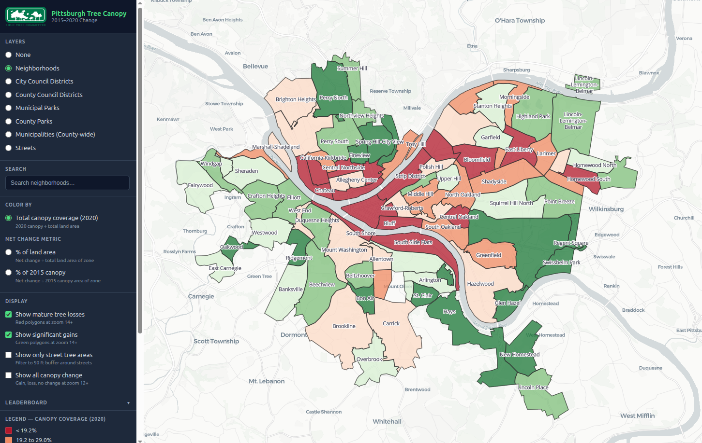
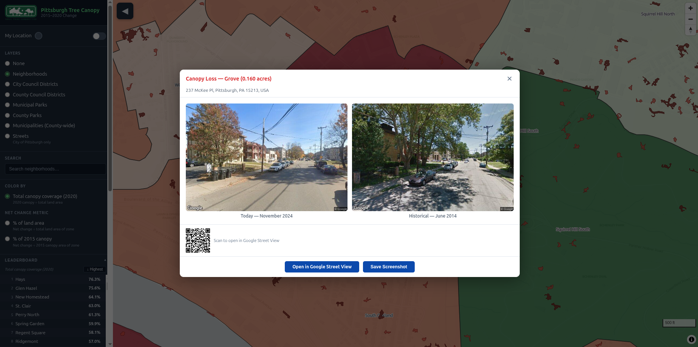

# Pittsburgh Tree Canopy Visualization

An interactive web map showing tree canopy gain and loss across Pittsburgh
from 2015 to 2020, built for the
[Squirrel Hill Urban Coalition](https://shuc.org/about-us/committees/parks-and-open-space-committee/)
tree committee.





---

## What It Shows

The map lets community members explore where Pittsburgh's tree canopy has
grown or shrunk between 2015 and 2020. Key features:

- **Boundary-level choropleth** — view canopy change by neighborhood,
  city/county council district, municipal/county park, municipality
  (county-wide), or street, colored by selected metric
- **Three color metrics** — total 2020 canopy coverage, net change as % of
  land area, or net change as % of 2015 canopy baseline
- **Leaderboard** — collapsible ranked list of all zones by the active
  metric, with hover-to-highlight and click-to-fly-to
- **Full canopy change overlay** — toggle all 3.3M canopy polygons (gain,
  loss, no change) visible at zoom 12+
- **Significant gains and losses** — zoom in to see individual gain/loss
  polygons ≥ 0.04 acres, with click-to-Street-View links
- **Street View before/after** — click any loss polygon to see a side-by-side
  comparison of Google Street View imagery from before and after the canopy change
- **Street tree filter** — filter gain/loss overlays to only show polygons
  within the 50 ft street buffer zone
- **Search** — search for any boundary zone by name and fly to it on the map
- **Zone labels** — boundary names displayed directly on the map
- **Hover details** — mouse over any zone to see a popup with full canopy
  statistics including gains/losses breakdown

---

## Project Structure

```
pgh-tree-canopy/
├── data-pipeline/          # Python scripts: GDB → GeoJSON / PMTiles
│   ├── scripts/
│   │   ├── 01_extract_boundary_layers.py
│   │   ├── 02_extract_mature_tree_losses.py
│   │   ├── 03_generate_pmtiles.py
│   │   ├── 04_street_buffer.py
│   │   ├── 05_street_canopy_stats.py
│   │   ├── 06_tag_street_buffer.py
│   │   └── 07_full_canopy_change.py
│   ├── output/             # Generated data files (not committed to git)
│   │   ├── boundary_layers/
│   │   ├── canopy_change/
│   │   └── streets/
│   ├── requirements.txt
│   └── README.md
├── web-app/                # React + MapLibre GL JS web map
│   ├── src/
│   │   ├── components/     # MapView, Sidebar, InfoPanel, Leaderboard, TreePopup
│   │   ├── config/         # Layer definitions and color scales
│   │   ├── hooks/          # Data fetching and quantile break computation
│   │   ├── App.jsx
│   │   └── index.css
│   ├── public/
│   │   ├── data/           # Symlink → ../../data-pipeline/output
│   │   └── images/
│   └── README.md
├── source-gis-data/        # Raw GDB source files (not committed to git)
└── PROJECT-OVERVIEW.md     # Original requirements and GIS parameters
```

---

## Source Data

| Dataset | Source | Description |
|---------|--------|-------------|
| `TreeCanopyChange_2015_2020_AlleghenyCounty.gdb` | Allegheny County / Western PA Conservancy | Tree canopy change polygons and pre-computed stats for administrative boundaries |
| `PittsburghRoads/p20/context.gdb` | City of Pittsburgh | Street centerlines |

Source data files are not included in this repository due to size.
Contact the Squirrel Hill Urban Coalition for access.

---

## Running the Data Pipeline

**System requirements:**
- Linux or macOS
- Python 3.9+
- GDAL (`ogrinfo` available on PATH)
- tippecanoe: `sudo apt-get install tippecanoe` (Ubuntu/Debian)

**Setup:**
```bash
git clone https://github.com/sblu/pgh-tree-canopy.git
cd pgh-tree-canopy
pip install -r data-pipeline/requirements.txt
```

Place the source GDB files under `source-gis-data/` as shown in the
project structure above, then run the pipeline scripts in order:

```bash
python3 data-pipeline/scripts/01_extract_boundary_layers.py
python3 data-pipeline/scripts/02_extract_mature_tree_losses.py
python3 data-pipeline/scripts/03_generate_pmtiles.py
python3 data-pipeline/scripts/04_street_buffer.py
python3 data-pipeline/scripts/05_street_canopy_stats.py   # ~10–30 min
python3 data-pipeline/scripts/06_tag_street_buffer.py
python3 data-pipeline/scripts/07_full_canopy_change.py    # ~15–30 min
```

Each script writes intermediate GeoJSON files to `data-pipeline/output/`
that can be opened directly in QGIS for visual inspection and validation.

See [`data-pipeline/README.md`](data-pipeline/README.md) for detailed
documentation of each script, output schemas, and CRS information.

---

## Running the Web App

**Requirements:** Node.js 20+

```bash
cd web-app
npm install

# Create symlink so the dev server can access pipeline output
ln -s ../../data-pipeline/output public/data

# Set up Google Maps API key for Street View feature (optional)
cp .env.example .env
# Edit .env and add your key — see web-app/README.md for details

npm run dev
```

Opens at http://localhost:5173. See [`web-app/README.md`](web-app/README.md)
for build and deployment instructions, including
[Google Maps API setup](web-app/README.md#google-maps-api-key).

---

## Milestones

| # | Milestone | Status |
|---|-----------|--------|
| 1 | Data pipeline — boundary layers + mature tree losses | ✅ Complete |
| 2 | Data pipeline — street buffer + per-street stats | ✅ Complete |
| 3 | Web visualization — React + MapLibre map prototype | ✅ Complete |
| 4 | Web visualization — street layer + search | ✅ Complete |
| 5 | Publish to GitHub | ✅ Complete |
| 6 | Street View links, leaderboard, coverage metric, street buffer filter | ✅ Complete |
| 7 | Full 3.3M canopy polygon PMTiles layer | ✅ Complete |
| 8 | County-wide municipal boundary layer | ✅ Complete |

---

## Technical Stack

| Component | Technology |
|-----------|-----------|
| Data pipeline | Python 3.9, geopandas 1.0.1, pyogrio 0.11.1, shapely 2.0.7, pyproj 3.6.1 |
| Tile generation | tippecanoe 2.49+ (PMTiles format) |
| Web map | React 19, Vite 5, MapLibre GL JS 5, react-map-gl 8 |
| Vector tiles | pmtiles 4 (browser protocol handler) |
| Street View | Google Maps JavaScript API (optional, requires API key) |
| Basemap | CartoDB Positron (free, no API key) |
| Hosting | Static files (any web server) |
| Source GIS data | ESRI File Geodatabase (.gdb), EPSG:2272 |
| Web data format | GeoJSON (EPSG:4326), PMTiles (vector tiles) |

---

## Methodology

Canopy change is measured using the Western Pennsylvania Conservancy's
2015–2020 tree canopy change dataset for Allegheny County. Each polygon
in the dataset is classified as canopy gain, canopy loss, or no change.

**Color metric definitions:**

> **Total canopy coverage (2020):**
> `canopy_2020_pct = (canopy_2020_acres / land_area_acres) × 100`
>
> Example: 5 acres of canopy in a 10-acre neighborhood = **50% coverage**

> **Net change as % of land area:**
> `net_pct_of_area = ((gain_acres − loss_acres) / land_area_acres) × 100`
>
> Example: 1 acre gained, 2 acres lost in a 10-acre neighborhood = **−10%**

> **Net change as % of 2015 canopy:**
> `net_pct_of_2015_canopy = ((gain_acres − loss_acres) / canopy_2015_acres) × 100`
>
> Example: 1 acre gained, 2 acres lost from 3-acre 2015 canopy = **−33%**

**Mature tree threshold:**
Individual tree polygons ≥ 0.04 acres (roughly one mature tree canopy);
grove polygons ≥ 0.07 acres (2+ mature trees).

**Street tree buffer:**
A 50 ft buffer is applied around Pittsburgh street centerlines in
EPSG:2272 (Pennsylvania South State Plane, US survey feet) to define
the street-tree zone. Canopy statistics are computed both for the
buffer area as a whole and per individual street segment.

---

## Contributing

This project is maintained by the
[Squirrel Hill Urban Coalition](https://shuc.org) tree committee.
Contributions, bug reports, and suggestions are welcome via GitHub Issues.

---

## License

Data pipeline scripts: [MIT License](LICENSE)

Source GIS data is provided by Allegheny County and the Western Pennsylvania
Conservancy and is subject to their respective terms of use.
